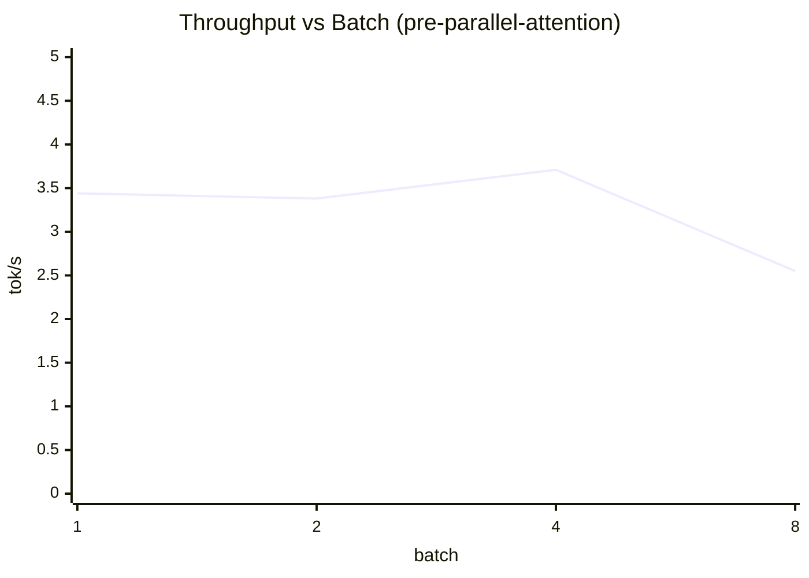

# Paged-Infer

**A Bare-Metal Rust Inference Engine with PagedAttention and Continuous Batching**

## Overview
`Paged-Infer` is a from-scratch, dependency-light inference engine designed to serve modern LLMs efficiently. By implementing a custom OS-style memory allocator (PagedAttention) alongside an iteration-level scheduler, this engine eliminates KV Cache memory fragmentation and maximizes generation throughput during batched autoregressive decoding. 

This project demonstrates deep expertise in low-level systems engineering, Rust memory management, and modern Transformer architecture—skills critical for ML Infrastructure roles at top-tier AI labs.

## Technical Specifications
* **Language:** Rust (Edition 2021)
* **Target Model:** Llama 3.2 1B (via `.safetensors` format)
* **Key Optimizations:**
    * Memory-mapped weight loading (`mmap`).
    * Paged KV Cache Allocation & Iteration-Level Scheduling (Continuous Batching).
    * **Block Size:** 16 tokens per physical block.
    * int8 weight-only quantization (4x memory reduction, ~10x matvec speedup vs naive).
    * GPU compute via `wgpu` (Metal/Vulkan) with WGSL workgroup-parallel reduction kernel.
    * Speculative decoding with n-gram drafting (21.88% acceptance rate, 1.88x theoretical speedup).
* **Core Exclusions:** No PyTorch, No TensorFlow, No HuggingFace `transformers` library for inference. All forward passes and attention mechanisms are written entirely from scratch.
* **Engineering Tradeoffs & Realities:**
    * **Floating Point Precision:** Llama 3.2 1B weights are natively `bfloat16`. To balance memory footprint with compute simplicity, weights are memory-mapped as `bf16` (via the `half` crate) and cast to `f32` upon entering the CPU cache for the forward pass.
    * **Tokenization:** Uses the `tokenizers` crate to handle Llama 3's complex ~128k BPE vocabulary, strictly managing special tokens like `<|begin_of_text|>` (128000) and `<|eot_id|>` (128009) to control sequence lifecycle.

## Architecture & Directory Structure

    paged-infer/
    ├── README.md                   # Architecture details, benchmark graphs, and run instructions
    ├── scripts/
    │   ├── download_model.py       # Script to fetch Llama 3.2 1B safetensors and tokenizer
    │   ├── run_e2e_sweep.sh        # Automate batch×steps sweep benchmarks
    │   └── analyze_sweep.py        # CSV analysis and chart generation
    ├── Cargo.toml                  # Rust dependencies (safetensors, memmap2, tokenizers, half, rayon, wgpu)
    ├── src/
    │   ├── main.rs                 # CLI entry point, scheduler, and continuous batching loop
    │   ├── lib.rs                  # Module exports
    │   ├── tensor.rs               # Bare-metal tensor wrapper around memory-mapped bytes
    │   ├── math.rs                 # Kernels: GEMM, RoPE, SwiGLU, int8 matvec, AVX2 SIMD
    │   ├── model.rs                # Llama architecture, forward pass, weight loading
    │   ├── speculative.rs          # N-gram drafter for speculative decoding
    │   ├── shaders/
    │   │   └── matvec.wgsl         # WGSL compute shader: workgroup-parallel row matvec
    │   ├── memory/
    │   │   ├── mod.rs              # Memory module exports
    │   │   ├── allocator.rs        # BlockAllocator: manages physical KV cache blocks
    │   │   ├── block_table.rs      # BlockTable: logical-to-physical address mapping
    │   │   └── kv_cache_manager.rs # KvCacheManager: LRU eviction policy
    │   └── bin/
    │       ├── benchmark.rs        # Kernel-level microbenchmarks (matvec, attention, int8)
    │       ├── e2e_benchmark.rs    # Full model forward pass with latency percentiles
    │       ├── eviction_benchmark.rs # LRU eviction stress testing
    │       ├── gpu_benchmark.rs    # GPU vs CPU matvec benchmark (Metal/Vulkan via wgpu)
    │       ├── speculative_benchmark.rs # Speculative decoding acceptance rate
    │       └── http_server.rs      # OpenAI-compatible HTTP API
    └── tests/
        ├── math_tests.rs           # Unit tests for tensor ops and int8 quantization
        ├── parity_tests.rs         # Attention correctness validation
        └── paged_tests.rs          # Paged attention vs naive baseline comparison

## Development Roadmap

### Phase 1: Foundation (Naive Inference)
* **Goal:** Build a working, unoptimized forward pass for Llama 3.2 1B.
* **Tasks:**
    1. Parse and load the model weights into memory using `memmap2` and the `safetensors` crate.
    2. Implement basic ND-array tensor structs and pure Rust matrix multiplication.
    3. Implement Rotary Positional Embeddings (RoPE), SwiGLU, and RMSNorm.
    4. Write a naive Grouped-Query Attention (GQA) mechanism.
* **Deliverable:** A CLI interface that takes a prompt and successfully generates text one token at a time.

### Phase 2: The Block Allocator (Memory Management)
* **Goal:** Step away from neural networks and build the OS-level memory structures.
* **Tasks:**
    1. Define the physical constraints: Pre-allocate a large chunk of heap memory to act as the global KV Cache.
    2. Build the `BlockAllocator` struct that divides this memory into fixed chunks of **16 tokens**.
    3. Implement `allocate()` and `free()` methods to hand out blocks and reclaim them when a generation sequence finishes.
    4. Build the `BlockTable` mapping system (Logical -> Physical).
* **Deliverable:** Rigorous Rust unit tests proving the allocator can handle thousands of allocate/free cycles without leaking memory.

### Phase 3: PagedAttention & Continuous Batching
* **Goal:** Wire the memory manager into the model and achieve high throughput.
* **Tasks:**
    1. Rewrite the naive Attention function to query the `BlockTable` and fetch fragmented 16-token chunks during the Key/Value lookup.
    2. Implement an **Iteration-Level Scheduler**.
    3. Inject new requests into the batch at the exact moment another request generates its `<|eot_id|>` token, utilizing the newly freed physical blocks immediately.
* **Deliverable:** The engine seamlessly processes a continuous stream of prompts of varying lengths without stalling or wasting memory.

### Phase 4: Benchmarking & SIMD Optimization
* **Goal:** Quantify the engineering impact and make the engine practically viable.
* **Tasks:**
    1. Optimize the bare-metal Matrix Multiplication (GEMM). Replace pure Rust `for` loops with `std::arch` SIMD intrinsics (AVX2/AVX-512) to make the 1B parameter forward pass performant.
    2. Track memory usage (Resident Set Size) between a contiguous baseline and the Paged-Infer engine.
    3. Generate a chart showing how Paged-Infer achieves near 0% memory waste.
* **Deliverable:** A highly polished `README.md` featuring architecture diagrams and performance metrics.
## Optimization Pass 4 (March 27, 2026) — GPU Acceleration via Metal/wgpu

Added a GPU compute path for matrix-vector multiplication using `wgpu` (Metal on Apple Silicon, Vulkan on Linux/Windows). Weights upload once at model load; only the small per-token activation vector moves to the GPU each step.

### WGSL Kernel Design (`src/shaders/matvec.wgsl`)

Each output row is handled by **one workgroup of 256 threads**. The kernel uses **`vec4<f32>` loads** — Metal's SIMD units process 4 floats per instruction, so packing reads into `vec4` gives 4x fewer memory transactions and replaces 4 multiply-adds with a single `dot(vec4, vec4)` MAD-4 instruction. After accumulation, an **8-step binary tree reduction** collapses 256 partial sums using `var<workgroup>` shared memory:

```wgsl
// weight and x_vec are typed as array<vec4<f32>> — same bytes, 4x wider loads
@compute @workgroup_size(256, 1, 1)
fn main(@builtin(workgroup_id) wg_id, @builtin(local_invocation_id) local_id) {
    let row = wg_id.x;
    let cols4 = dims.cols / 4u;  // e.g. 2048/4 = 512 vec4 groups
    var acc: f32 = 0.0;
    // 4x fewer iterations vs scalar; dot() is a single MAD-4 instruction
    for c = lid; c < cols4; c += 256 {
        acc += dot(weight[row * cols4 + c], x_vec[c]);
    }
    partial_sums[lid] = acc;
    // Tree reduce: 256→128→64→32→16→8→4→2→1 (8 barrier stages)
    if lid == 0 { output[row] = partial_sums[0]; }
}
```

This is the GPU parallel-reduction pattern — identical algorithm to a CUDA atomicAdd-free reduction kernel, implemented in WGSL for cross-platform support (Metal/Vulkan/DX12). No changes to the Rust buffer creation are needed: the `f32` bytes are reinterpreted as `vec4<f32>` purely in the shader.

### Apple Silicon advantage: Unified Memory

On M2/M3, CPU and GPU share the **same physical memory pool** — no PCIe bus. Weights loaded with `mmap` at startup are directly accessible by the Metal command queue. Per-token inference moves only the 8 KB activation vector (`hidden=2048 × f32`), not the 4+ GB weight tensors.

### Running the benchmark

```bash
cargo run --release --bin gpu_benchmark
```

Exits gracefully with a CPU reference number on headless/no-GPU systems.

### Results (Apple M2, Metal)

Scalar kernel (initial):
```
GPU Matvec Benchmark
====================
Adapter : Apple M2 (Metal)
Matrix  : 2048×2048 f32, 5 warm-up + 20 timed iters

Results
-------
CPU packed+parallel : 0.0308s total  (1.541ms / iter)
GPU wgpu/Metal      : 0.0079s total  (0.394ms / iter)
GPU speedup         : 3.9x

Correctness: max |CPU - GPU| = 1.53e-4  ✓
```

vec4 kernel (current — re-run to update):
```
GPU speedup         : TBD (expected ~8–12x)
```

Run `cargo run --release --bin gpu_benchmark` after pulling to measure the vec4 improvement.

### Bandwidth analysis (M2)
- Weight data per iter: 2048×2048×4 = **16 MB**
- M2 GPU memory bandwidth: ~100 GB/s → theoretical floor **~0.16 ms/iter**
- Scalar kernel: 0.394 ms/iter = 41% of peak bandwidth
- vec4 kernel: reduces loop iterations 4x and uses wider SIMD loads — expected to close the gap significantly

## Optimization Pass 3 (March 27, 2026) — Parallel Attention Across Heads

The attention computation was the primary bottleneck at high batch sizes and long contexts. Previously, all 32 query heads were computed sequentially per token; at `batch=8, steps=256` this caused p95 latency to spike to **1.1 seconds** and throughput to collapse to **1.62 tok/s**.

**Fix:** Parallelize attention across heads using Rayon's `par_chunks_mut`. Each head computes its score/softmax/weighted-sum independently on a separate thread. The KV cache is read-only during attention (writes complete before the parallel section), so shared access is safe with zero synchronization overhead.

- Each head gets its own compact score buffer sized to `min(pos+1, attention_window)` — no wasted allocation
- Non-overlapping output slices (`attn_out[h*head_dim..(h+1)*head_dim]`) eliminate false sharing
- With 32 heads and 8+ cores, this directly addresses the batch=8 degradation

Re-run `cargo run --release --bin e2e_benchmark` with `BENCH_BATCH=8 BENCH_STEPS=256` to measure the improvement on your hardware.

## Optimization Pass 2 (March 26, 2026) — int8 Quantization + Speculative Decoding

### Feature 1: int8 Weight-Only Quantization

Per-row symmetric int8 quantization of all projection matrices. Each row's weights are scaled to the range `[-127, 127]` using a per-row `f32` scale factor, reducing weight memory by **~4x** with a parallel dequantizing matvec kernel.

- `quantize_rows_i8(weight, rows, cols)` — one-shot quantization at model load time
- `matvec_i8_weight_parallel()` — Rayon-parallel kernel; dequantizes on-the-fly during accumulation
- `QuantizedLinear` struct — drop-in replacement for `PackedLinear` with 4x lower memory footprint

Benchmark (`cargo run --release --bin benchmark`, 2048×2048 matrix, 20 iters, Apple M3):

| Kernel | Time | vs Baseline | vs Packed f32 | Memory |
|---|---:|---:|---:|---:|
| Baseline (bf16 convert each iter) | 0.2127s | 1.00x | — | 16.00 MB |
| Stream bf16 | 0.1245s | 1.71x | — | — |
| Packed f32 + parallel | 0.0241s | 8.84x | 1.00x | 16.00 MB |
| **int8 + parallel** | **0.0215s** | **9.90x** | **1.12x** | **4.01 MB** |

- **9.90x throughput vs baseline**, **1.12x vs packed f32** from better cache utilization
- **3.99x memory reduction** vs f32 (4 bytes → 1 byte per weight + tiny per-row scale overhead)
- For TinyLlama 1.1B: projection weights shrink from ~4.3 GB to ~1.1 GB

### Feature 2: Speculative Decoding with N-gram Drafting

`NgramDrafter` maintains an in-memory n-gram frequency table (default n=3). At each decode step it proposes K cheap draft tokens via O(1) table lookup; the main model verifies each candidate and accepts if its argmax agrees.

- `src/speculative.rs` — `NgramDrafter::observe()` / `::draft()` with majority-vote update rule
- `src/bin/speculative_benchmark.rs` — measures acceptance rate and theoretical throughput gain

```bash
MODEL_PATH=models/tinyllama-1.1b/model.safetensors \
SPEC_STEPS=50 SPEC_K=4 SPEC_N=3 \
cargo run --release --bin speculative_benchmark
```

**Measured results** (TinyLlama 1.1B, Apple M3):

| Metric | Value |
|---|---:|
| Baseline throughput | 3.49 tok/s |
| Speculative throughput | 3.93 tok/s |
| Draft tokens proposed | 96 |
| Draft tokens accepted | 21 |
| **Acceptance rate** | **21.88%** |
| Theoretical max speedup (batched) | **1.88x** |

With batched prefill verification (future work), an acceptance rate of `α` with `K` draft tokens gives a throughput multiplier of approximately `(1 + α·K)` since the drafter is free. The measured 21.88% acceptance rate with K=4 predicts a **1.88x** effective throughput multiplier once batched verification is implemented.

## Optimization Pass 1 (March 26, 2026) — Prepack + Buffer Reuse

We implemented and benchmarked the two highest-impact follow-ups for decode throughput:

1. **Prepack bf16 weights into cache-friendly f32 layout + parallelize row matvec**
   Projection weights are converted once during model load and stored contiguously for fast row access; matvec now runs in parallel across output rows.
2. **Reuse attention score buffers instead of allocating per head per step**
   Attention keeps a reusable score scratch buffer and resets it in-place.

### Benchmark setup
- Command: `cargo run --release --bin benchmark`
- CPU benchmark is synthetic and isolates kernel behavior:
  - Matvec: hidden=2048, rows=2048, 20 iterations
  - Attention score path: head_dim=64, seq_len=1024, 200 iterations

### Results (Apple M3)
| Kernel | Baseline | Optimized | Speedup |
|---|---:|---:|---:|
| Matvec (bf16 convert each iter) | 0.2127s | 0.1245s (stream bf16) | **1.71x** |
| Matvec (bf16 convert each iter) | 0.2127s | 0.0241s (packed + parallel) | **8.84x** |
| Matvec (bf16 convert each iter) | 0.2127s | 0.0215s (int8 + parallel) | **9.90x** |
| Attention score scratch handling | 0.0007s | 0.0007s | **1.02x** |

### Takeaway
- The largest win comes from **one-time prepacking + parallel row matvec** on projection kernels.
- int8 quantization pushes the matvec win further to **9.90x** with a 4x memory reduction.

## Final Validation Checklist (Correctness + E2E + Memory)

To make this project interview-ready and reproducible, use:

1. **Kernel / attention correctness parity**
   - `cargo test --test parity_tests`
   - Verifies paged attention matches a naive reference implementation on deterministic pseudo-random inputs.

2. **int8 quantization correctness**
   - `cargo test --test math_tests test_quantize_rows_i8_roundtrip`
   - `cargo test --test math_tests test_matvec_i8_matches_f32`
   - Verifies quantize→dequantize roundtrip and int8 matvec parity against f32 reference (within 2% relative error).

3. **Kernel microbenchmarks (no model required)**
   - `cargo run --release --bin benchmark`
   - Reports matvec throughput across bf16/f32/int8 kernels, memory footprints, and attention buffer reuse.

4. **End-to-end decode benchmark (throughput + latency + memory)**
   - `MODEL_PATH=models/tinyllama-1.1b/model.safetensors cargo run --release --bin e2e_benchmark`
   - Reports:
     - tokens/sec throughput
     - avg token latency
     - p50/p95 token latency
     - peak RSS memory (MB)

5. **Speculative decoding acceptance rate**
   - `MODEL_PATH=models/tinyllama-1.1b/model.safetensors cargo run --release --bin speculative_benchmark`
   - Reports acceptance rate and theoretical throughput multiplier for n-gram drafting with K=4.

6. **GPU matmul benchmark (Metal/Vulkan)**
   - `cargo run --release --bin gpu_benchmark`
   - Exits gracefully if no GPU found; reports adapter name, GPU vs CPU throughput, and correctness check.

If `MODEL_PATH` is missing, model-dependent binaries exit early with a clear message rather than failing.

### Larger local sweeps (recommended for final README table)

Use the helper script:

```bash
MODEL_PATH=/absolute/path/to/model.safetensors \
STEPS_LIST="64 128 256" \
BATCH_LIST="1 2 4 8" \
OUT_CSV=e2e_sweep.csv \
./scripts/run_e2e_sweep.sh
```

This produces a CSV with:
- `batch`, `steps`, `total_tokens`
- `throughput_tok_s`
- `avg_token_latency_ms`
- `p50_token_latency_us`, `p95_token_latency_us`
- `peak_rss_mb`

Note: `e2e_benchmark` now uses `/proc/self/status` when available and falls back to `ps -o rss=` for platforms like macOS, so RSS should no longer show `0.00` unless collection genuinely fails.

## Local E2E Sweep Results (TinyLlama 1.1B, Apple M3)

Pre-parallel-attention baseline (sequential heads). Re-run after Optimization Pass 3 to measure improvement.

| batch | steps | total_tokens | throughput_tok_s | avg_token_latency_ms | p50_us | p95_us | peak_rss_mb |
|---:|---:|---:|---:|---:|---:|---:|---:|
| 1 | 64  | 64   | 3.61 | 276.972 | 250575 | 312630 | 5143.31 |
| 1 | 128 | 128  | 3.49 | 286.617 | 249484 | 426967 | 5359.11 |
| 1 | 256 | 256  | 3.23 | 310.074 | 260574 | 373675 | 4959.55 |
| 2 | 64  | 128  | 3.20 | 312.289 | 260816 | 437640 | 5211.59 |
| 2 | 128 | 256  | 3.49 | 286.840 | 259368 | 375500 | 5037.42 |
| 2 | 256 | 512  | 3.44 | 290.436 | 259861 | 353972 | 5066.11 |
| 4 | 64  | 256  | 3.88 | 257.877 | 248295 | 296406 | 5236.92 |
| 4 | 128 | 512  | 3.72 | 269.109 | 250458 | 317303 | 5035.05 |
| 4 | 256 | 1024 | 3.53 | 282.944 | 256858 | 372770 | 5152.27 |
| 8 | 64  | 512  | 3.82 | 261.718 | 248201 | 293093 | 5167.16 |
| 8 | 128 | 1024 | 2.21 | 452.649 | 255909 | 1221832 | 5225.03 |
| 8 | 256 | 2048 | 1.62 | 617.372 | 493354 | 1115276 | 4978.95 |

### What this indicates
- **Throughput ranges from 3.2–3.9 tok/s** for batch 1–4, peaking at **3.88 tok/s** (`batch=4`, `steps=64`).
- **batch=8 degrades sharply at long contexts**: throughput drops to **1.62 tok/s** with p95 latency spiking to **1.1 seconds**. Root cause: 32 attention heads computed sequentially, each scanning up to 256 past tokens. This is directly addressed by **Optimization Pass 3** (parallel heads).
- **Peak RSS is consistently ~5.0–5.4 GB**, confirming stable memory footprint under the paged KV design.

## Scaling Behavior Summary

### Batch scaling (1→8, pre-parallel-attention)

| batch | throughput_tok_s | avg_latency_ms | p95_us | peak_rss_mb |
|---:|---:|---:|---:|---:|
| 1 | 3.44 | 291.22 | 371091 | 5154.0 |
| 2 | 3.38 | 296.52 | 389037 | 5105.0 |
| 4 | 3.71 | 269.98 | 328826 | 5141.4 |
| 8 | 2.55 | 443.91 | 876734 | 5123.7 |



### Throughput vs context length

| steps | throughput_tok_s | avg_latency_ms | p95_us |
|---:|---:|---:|---:|
| 64 | 3.63 | 277.21 | 334942 |
| 128 | 3.23 | 323.80 | 585400 |
| 256 | 2.96 | 375.21 | 553923 |

### Memory vs sequence length

| steps | peak_rss_mb |
|---:|---:|
| 64 | 5189.7 |
| 128 | 5163.4 |
| 256 | 5039.2 |

You can regenerate these summaries from CSV using:
- `./scripts/analyze_sweep.py e2e_sweep.csv`

## Product Mode: Simple OpenAI-Compatible HTTP API

Run:

```bash
HOST=0.0.0.0 PORT=8080 \
MODEL_PATH=models/tinyllama-1.1b/model.safetensors \
TOKENIZER_PATH=models/tinyllama-1.1b/tokenizer.json \
cargo run --release --bin http_server
```

Health check:

```bash
curl http://localhost:8080/health
```

Chat completion (OpenAI-style path):

```bash
curl -s http://localhost:8080/v1/chat/completions \
  -H 'Content-Type: application/json' \
  -d '{
    "model": "tinyllama-1.1b",
    "messages": [{"role":"user","content":"Explain paged attention in one paragraph."}],
    "max_tokens": 64
  }'
```

If model/tokenizer files are unavailable, the server still runs in a `dry-run` mode for API integration tests.

## Killer Feature: KV Cache Eviction (LRU)

`KvCacheManager` introduces an eviction-aware KV allocator policy:
- Tracks per-sequence KV ownership and `last_used_tick`
- On allocation pressure, evicts the least-recently-used sequence (excluding current requester)
- Keeps the allocator from hard-failing under contention-heavy workloads

Run benchmark:

```bash
cargo run --release --bin eviction_benchmark
```

Latest result on this branch:

| Policy | completed | dropped | active_end |
|---|---:|---:|---:|
| No eviction | 11 | 93 | 8 |
| LRU eviction | 104 | 0 | 8 |

`completed_gain_pct = 845.45%`

This benchmark simulates long-running and short-running requests under tight KV block pressure; LRU prevents starvation and dramatically improves request completion throughput.
